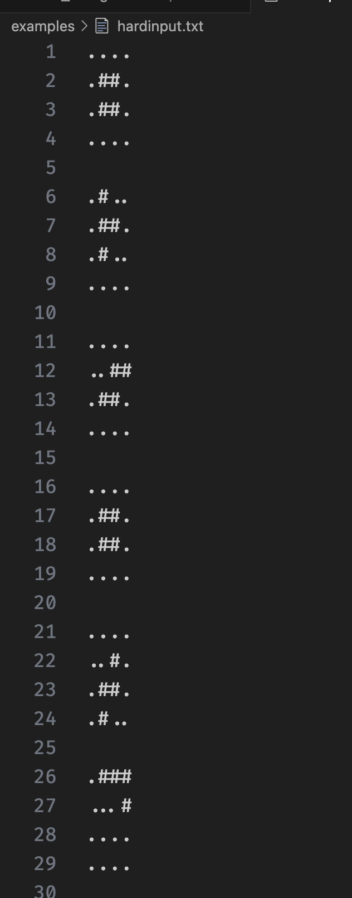
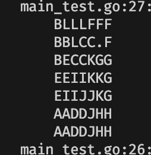

# Tetris optimizer

this is a project to take tetris pieces from a file and then return the same pieces packed together as tightly as possible.

for example this is one input file


and after running the code using

```bash
go run . tetris.txt
```

you get this result. keep in mind that it will also give each piece it's own letter to better help you distinguish between each of them



## Usage
to run this you need to use

```bash
go run . [filename]
```

## test
```bash
go test main_test.go -v
```
it will show the test results
